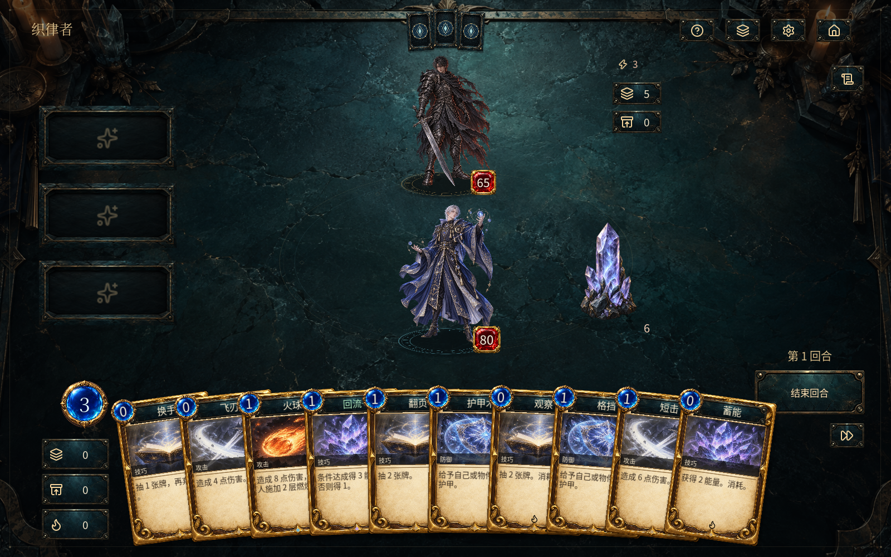

# 织律者 · 规则之外 0.5.0

Godot 原生离线卡牌冒险。本版是在原 0.4.0 上制作的奇幻材质 UI 试玩候选版，不是已通过商业发行验收的正式版。



## 开始游玩

从 [v0.5.0 试玩版下载页](https://github.com/K1True-1/weaver-native/releases/tag/v0.5.0) 下载 `Weaver-Windows-0.5.0-Board.zip`，解压后双击文件夹中的 `Weaver.exe`，不需要安装 Godot、Node.js 或联网。不要把 GitHub 自动提供的 Source code 压缩包当作游戏程序。

本地构建输出位于 `dist/Weaver-Windows-0.5.0/Weaver.exe`。

- 看地图：点击「开启冒险」，选择金色节点，再点击「踏入此地」。
- 试战斗：点击「规则练习」，固定起手十张牌，方便比较动作与画面。
- 悬停放大手牌；点击选牌后点击目标，或直接拖到目标。
- 拖进左侧规则槽，选择条件和目标，确认后安装。
- 空手点击棋盘摆件：播放材质反馈、微动与音效，不消耗资源。悬停查看用途；选牌 / 拖牌到物件上才会攻击、防护或修复。
- 右键 / Esc：取消选择、拖拽或未确认安装；拖拽期间不会误触数字键、空格或 Enter。
- F11：全屏。空格：结束回合。设置中可调整音效、动效和快速结算。

初次试玩组合：将「短击」安装到「施术之后」，目标为敌人，再手动打出「蓄能」或防御牌。

## 视觉与交互改版

- 与战场一致的暗青石板 / 旧铜按钮、嵌入式规则槽；羊皮纸卡牌和蓝宝石能量球保留精细金属边框。
- 敌上我下的纵向对峙；主角与灰刃全身立绘、呼吸微动和脚下召唤阵；没有角色姓名底框，名字在悬停提示中查看。
- 战场生命宝石只显示当前血量；牌库、弃牌、消耗、记录与导航使用图标，空规则槽不常驻教学文案。
- 8 种战斗物件全部换成无框独立摆件：透明素材、接地阴影、晶光 / 电弧 / 火星 / 水波互动、六类材质音效、击碎残片。点击区域跟随实体轮廓，空白处不会误触；减少动效设置也适用于摆件。
- 羊皮纸纵向地图：分叉虚线、已走过的实线路径、当前金色节点；后续节点为预览，不能提前进入。
- 第 2 / 4 站和第 6 / 7 站保留原设计的互补服务规则；没有伪造固定的后续敌人。
- 银发织律者主菜单、战场暗角、舞动微粒、施法圆环、规则连线和重击波纹。
- 保留弹簧拖拽、抓持点、邻牌让位、出牌落地反馈、敌人逐张翻牌和同步音效。
- 这是一套具有 2.5D 渲染质感的原生 2D 界面，不是实时 3D 人物与场景。

美术借鉴的是奇幻卡牌的材质语言与纵向路线结构，使用原创生成素材及开源图标，没有复制参考游戏的成品资产。新素材与提示词见 [美术记录](docs/ART-DIRECTION-0.5.md) 和 [实体摆件记录](docs/BOARD-PROPS-0.5.md)。

## 保留的游戏内容

三章冒险；战斗、精英、首领、商店、营地、事件、宝藏；30 种玩家卡、8 种触发条件、12 种物件、10 种遗物、15 种敌人；卡牌升级和删除；起始卡组及路线解锁。

敌人有真实牌组、手牌、费用和弃牌堆。规则安装占用实体卡、支付能量，响应也有费用；每回合首次成功响应减免 1 能量。合法连锁每 200 次响应暂歇一次。

## 存档与安全

本版使用独立目录 `%APPDATA%/Weaver/Native-0.5`，不覆盖旧版存档，也不会自动导入旧冒险。练习模式与正式冒险隔离。自动验证使用独立 QA 存档。

本地构建尚未签名，Windows 可能显示发布者未知。不要关闭系统安全防护；确认来源后再自行决定是否运行。

## 已验证与未验证

2026-09-20 在当前 Windows 机器 / RTX 5070 Ti 上运行 Godot 工程，并检查主菜单、战斗、放大卡牌、地图、地图进度及商店的实际截图。

自动检查：规则引擎 192 项，敌方牌组 949 项，卡牌运动 25 项，交互取消 16 项，路线地图 227 项，界面呈现 34 项，场景物件 71 项，共 1,514 项通过；另有动效时序、粒子数量上限、音效生成和减少动效检查通过。界面检查覆盖上下站位、生命数字、无字规则槽、图标牌堆和双敌人 / 双物件的点击区域。物件还通过游戏视口的鼠标事件路由验证了点击反馈。这不代表已经完成人工鼠标遍历所有 UI。

独立 Windows 程序的验证记录见 `docs/QA-0.5.md`。截图与程序启动成功不能代替长时间游玩、完整内容审查、跨显卡/分辨率验收或商业上线准备。

正式上线仍需：构筑平衡与完整多周目体验验证、其余敌人的全身立绘、更多专属卡图及 4 种非战斗服务物件图（这些部分仍存在复用）、正式音乐与音效、各尺寸可读性测试、安装与签名、平台材料、素材权属审查及异常存档恢复测试。未实现账号、支付、联机或运营后台。

## 开发与构建

使用 Godot 4.7.2 标准版。Godot MCP 可打开、运行和检查此工程；项目运行本身不依赖 MCP。

`tools/run-godot.cjs` 默认调用 PATH 中的 `godot`，也可以用环境变量 `GODOT_BIN` 指定自己的 Godot 程序路径；源码不依赖开发者本机安装位置。

```text
godot --headless --path . --script tests/engine_test.gd
godot --headless --path . --script tests/enemy_deck_test.gd
godot --headless --path . --script tests/card_motion_test.gd
godot --headless --path . --script tests/vfx_test.gd
godot --headless --path . --script tests/interaction_test.gd -- --qa
godot --headless --path . --script tests/map_test.gd
godot --headless --path . --script tests/presentation_test.gd -- --qa
godot --headless --path . --script tests/prop_test.gd -- --qa
```

Windows 导出使用官方 4.7.2 模板；本地模板位于 `build/templates/windows_release_x86_64.exe`。模板不进入源码版本管理。运行 `tools/fetch-windows-template.py` 可只下载官方模板归档中的 Windows release 成员并验证 ZIP CRC。

开源组件许可证随包附带，包括 Godot、Noto 字体和 Lucide 图标。旧版已有素材保持原有来源和声明。
